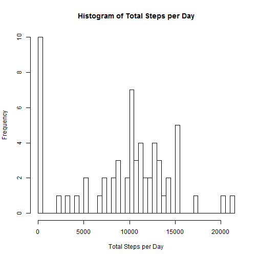
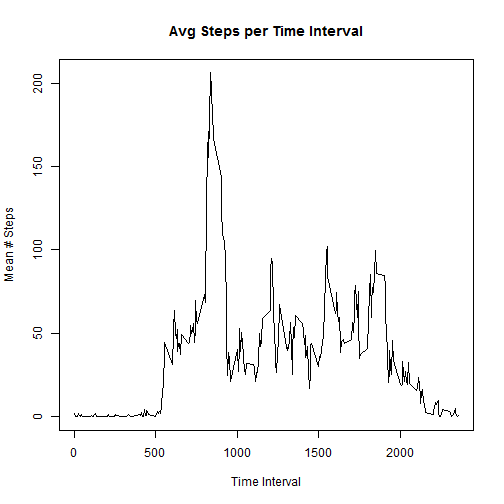
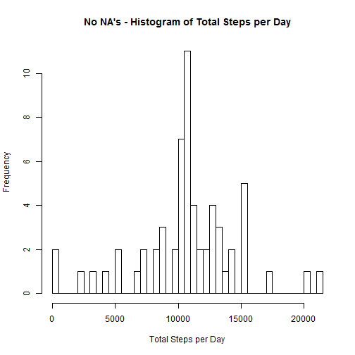
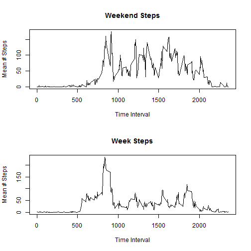

We begin our analysis of Personal Movement Activity by reading the data into R.


```r
oldDir <- getwd()
setwd("C:/Users/seanco/Desktop/DataScienceCoursera/Reproducible_Research/RepData_PeerAssessment1/activity")
theData <- read.csv("activity.csv")
uniqueDates <- unique(theData$date)
```


We then answer the question: "What is the mean total number of steps taken per day?"


```r
totalSteps = c()

for (i in 1:length(uniqueDates)){
  totalSteps[i] <- sum(theData[theData$date == uniqueDates[i],1],na.rm = TRUE)
}

hist(totalSteps,breaks = 50,xlab="Total Steps per Day",main="Histogram of Total Steps per Day")
```



```r
print(paste("Mean Total Steps per Day: ",round(mean(totalSteps),0),sep=" "))
```

```
## [1] "Mean Total Steps per Day:  9354"
```

```r
print(paste("Median Total Steps per Day: ",median(totalSteps),sep=" "))
```

```
## [1] "Median Total Steps per Day:  10395"
```

We then ask the question: "What is the average daily activity pattern?"

To answer this, we make a time series plot of the average number of steps taken per time interval.  We also ask: "Which 5-minute interval, on average across all the days in the dataset, contains the maximum number of steps?""


```r
meanSteps = c()
timeSteps <- unique(theData[,3])
maxStep = 0
maxIndex = 0
for (i in 1:length(timeSteps)) {
  meanSteps[i] = mean(theData[theData$interval == timeSteps[i],1],na.rm=TRUE)
  if (maxStep < meanSteps[i])  {
    maxStep <- meanSteps[i]
    maxIndex <- i
    }
}

plot(timeSteps,meanSteps,type = "l",main = "Avg Steps per Time Interval",ylab="Mean # Steps",xlab="Time Interval")
```



```r
print(paste("Time interval with the maximum average number of steps: ",timeSteps[maxIndex],sep=""))
```

```
## [1] "Time interval with the maximum average number of steps: 835"
```

To consider the effect of missing values, a copy of the original data set is made and the missing values are replaced with the mean for that 5-minute interval.

A histogram of the total number of steps taken each day without NA's was made, and the mean and median total number of steps taken per day were re-calculated. 


```r
print(paste("Number of Rows w/NA's: ",nrow(theData) - sum(as.integer(complete.cases(theData))),sep=""))
```

```
## [1] "Number of Rows w/NA's: 2304"
```

```r
newData <- theData
for (i in 1:nrow(newData)) {
  if (!(complete.cases(newData[i,]))) {
    newData[i,1] <- mean(theData[theData$interval == theData[i,3],1],na.rm=TRUE)
  }
}

newTotalSteps = c()
for (i in 1:length(uniqueDates)) {
  newTotalSteps[i] <- sum(newData[newData$date == uniqueDates[i],1],na.rm = TRUE)
}

hist(newTotalSteps,breaks = 50,xlab="Total Steps per Day",main="No NA's - Histogram of Total Steps per Day")
```



```r
print(paste("With NA's - Mean Total Steps per Day: ",round(mean(totalSteps),0),sep=" "))
```

```
## [1] "With NA's - Mean Total Steps per Day:  9354"
```

```r
print(paste("Without NA's - Mean Total Steps per Day: ",round(mean(newTotalSteps),0),sep=" "))
```

```
## [1] "Without NA's - Mean Total Steps per Day:  10766"
```

```r
print(paste("With NA's - Median Total Steps per Day: ",round(median(totalSteps),0),sep=" "))
```

```
## [1] "With NA's - Median Total Steps per Day:  10395"
```

```r
print(paste("Without NA's - Median Total Steps per Day: ",round(median(newTotalSteps),0),sep=" "))
```

```
## [1] "Without NA's - Median Total Steps per Day:  10766"
```

Removing the missing values causes the Mean Total Steps to increase and equal the Median Total Steps.  It seems that the NA's were improperly weighing down the mean.


Part 4: Finally, to display the difference between the week and the weekend Steps, we make plots of the average number of steps taken for both, averaged across all weekday days or weekend days. 


```r
days <- weekdays(as.POSIXlt(newData$date))
wknd <- c()
for (i in 1:length(days)) {
  if ((days[i] == "Saturday") | (days[i] == "Sunday")) {
    wknd[i]  <- TRUE
  } else {
    wknd[i] <- FALSE
  }
} 

weekData <- theData[!wknd,]
weekendData <- theData[wknd,]

weekendSteps <- c()
weekSteps <- c()

oldpar <- par()
for (i in 1:length(unique(weekendData[,3]))) {
  weekendSteps[i] = mean(weekendData[weekendData$interval == timeSteps[i],1],na.rm=TRUE)
}
for (i in 1:length(unique(weekData[,3]))) {
  weekSteps[i] = mean(weekData[weekData$interval == timeSteps[i],1],na.rm=TRUE)
}

par(mfrow = c(2,1))

plot(timeSteps,weekendSteps,type = "l",main = "Weekend Steps",ylab="Mean # Steps",xlab="Time Interval")

plot(timeSteps,weekSteps,type = "l",main = "Week Steps",ylab="Mean # Steps",xlab="Time Interval")
```



```r
par <- oldpar
```

